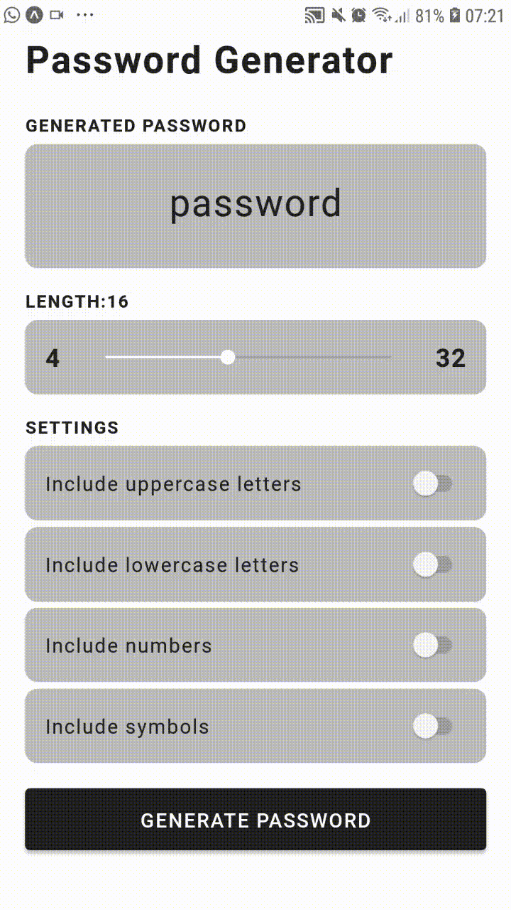

<h1 align="center">
  
</h1>

<h3 align="center">
 :construction: Em construção.. :construction:
</h3>

O projeto do aplicativo está em fase de desenvolvimento, a meta desse aplicativo é facilitar a vida da minha esposa na criação de senha forte e não colocar as mesmas senha em todos os lugares. :tada:

   
  

  

  

  <a href="#bulb-o-projeto-iphone">O Projeto</a>&nbsp;&nbsp;&nbsp;|&nbsp;&nbsp;&nbsp;
  <a href="#wrench-technologies">Tecnologias</a>&nbsp;&nbsp;&nbsp;|&nbsp;&nbsp;&nbsp;
  <a href="#lipstick-layout">Layout</a>&nbsp;&nbsp;&nbsp;|&nbsp;&nbsp;&nbsp;
  <a href="#fire-como-usar">Como usar</a>&nbsp;&nbsp;&nbsp;|&nbsp;&nbsp;&nbsp;
  <a href="#tada-como-contribuir">Como contribuir</a>&nbsp;&nbsp;&nbsp;|&nbsp;&nbsp;&nbsp;
  <a href="#white_check_mark-to-do-lists">To-Do Lists</a>&nbsp;&nbsp;&nbsp;|&nbsp;&nbsp;&nbsp;
  <a href="#page_facing_up-license">License</a>

## :bulb: O Projeto :iphone:

<h1 align="center">
    
</h1>

## :wrench: Technologies

Este projeto foi desenvolvido com as seguintes tecnologias:

- [Node.js](https://nodejs.org/en/)
- [TypeScript](https://www.typescriptlang.org/)
- [React Native](https://reactnative.dev/)
- [Expo](https://expo.io/)

## :lipstick: Layout

Para acessar o layout, use [Figma](https://www.figma.com).

## :fire: Como usar

## :tada: Como contribuir

## :white_check_mark: To-Do Lists

Uma lista rápida dos meus próprios planos (não necessariamente em ordem de execução):

  - [x] Criar os componentes.
  - [x] Criar a funcionalidade de gerar a senha.
  - [x] Criar a funcionalidade de copiar a senha.
  - [ ] Criar animações.
  - [ ] Fazer a refatoração do código.
  - [ ] Definir cores e tipografia.
  - [x] Mostrar a força da senha.
    - [x] (Password strength checked - zxcvbn) [Password strength checked - zxcvbn](https://github.com/dropbox/zxcvbn)
  - [ ] Colocar o aplicativo na Google Play.
  - [ ] (...)

## :page_facing_up: License

Este projeto está sob a licença do MIT. Consulte a LICENÇA para obter detalhes.

Feito por Tiago Neves :penguin: Entre em contato!
